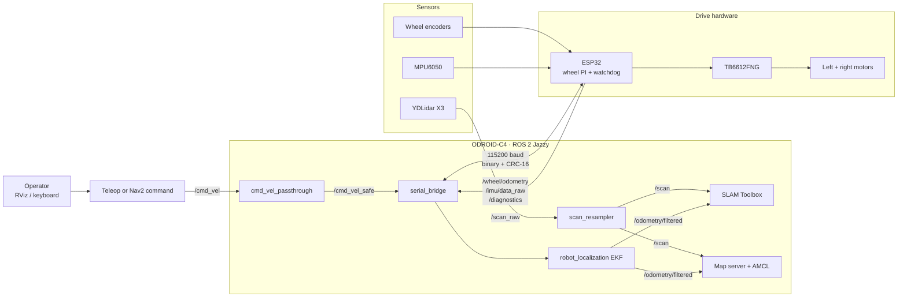
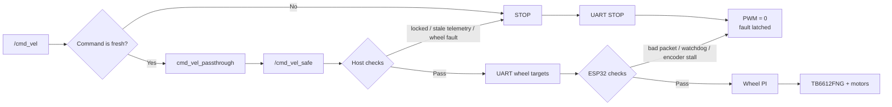
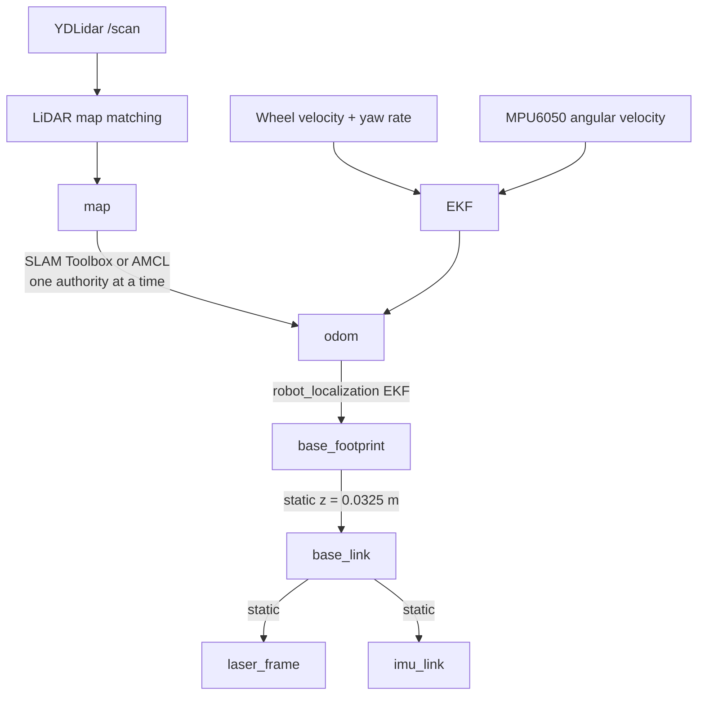

# Physical AMR Base Driver

[](https://docs.ros.org/en/jazzy/)
[](https://releases.ubuntu.com/24.04/)
[](https://www.hardkernel.com/shop/odroid-c4/)
[](LICENSE)

This ROS 2 Jazzy package runs on a physical indoor delivery robot. It connects
an ODROID-C4, ESP32 motor controller, YDLidar X3, wheel encoders, and MPU6050
to support driving, map creation with `slam_toolbox`, and AMCL localization.

This repository contains the robot-side hardware code, physical Nav2 profile,
and Robot Agent used to connect the robot to the web control platform.
The related projects are
[Indoor Delivery Robot Platform](https://github.com/nattannsra18/indoor-delivery-robot)
and
[AMR Navigation, Vision & Diagnostics](https://github.com/nattannsra18/amr-navigation-vision-diagnostics).

> [!CAUTION]
> A fresh base launch starts with motor output disabled. After telemetry and
> the physical area are verified, the base is armed once for the attended
> session. Normal AMCL, Nav2, and web-service restarts do not lock the motors.
> The physical motor cutoff stays within reach at all times.

## Hardware and software

| Part | Role |
|---|---|
| ODROID-C4 | Ubuntu 24.04 and ROS 2 Jazzy |
| ESP32-WROOM DevKit, 38-pin | Wheel PI, encoders, MPU6050, and UART telemetry |
| TB6612FNG | Left and right TT motor driver |
| TT motors, encoders, and passive caster | Differential-drive base |
| YDLidar X3 | Scan for SLAM and localization |
| `robot_localization` | Fuses wheel odometry with IMU data |
| `slam_toolbox` | Builds a 2D map |
| AMCL + map server | Localizes the robot on a saved map |

Physical-test notes are in [docs/VALIDATION.md](docs/VALIDATION.md). Room maps
and rosbags stay out of Git because they contain private layout and test data.

## System overview



The ODROID runs ROS, state estimation, and diagnostics. The ESP32 handles the
wheel loop and turns PWM off when commands stop arriving. SLAM and AMCL share
the same scan and EKF output, but operate as separate modes.

## Web Robot Agent

The source for the Robot Agent is included at
[`robot_agent/amr_web_bridge`](robot_agent/amr_web_bridge). It is the ROS 2
package that authenticates this ODROID with the FastAPI control plane, reports
telemetry, diagnostics, maps and Nav2 paths, and accepts only authenticated
navigation or emergency commands. The physical ODROID profile and hardened
systemd unit are included with the package.

The base driver and Agent are built together from the same workspace:

```bash
cd ~/amr_ws
source /opt/ros/jazzy/setup.bash
colcon build --symlink-install --packages-select amr_base_driver amr_web_bridge
source install/setup.bash
```

The profile in
`robot_agent/amr_web_bridge/config/profiles/odroid_c4_tt_prototype.yaml` is
the starting point for this chassis. Connection URL, enrollment token, and
credential file are deployment secrets and stay outside Git. The Agent can be
started with the profile after those values are configured:

```bash
ros2 run amr_web_bridge web_bridge_node --ros-args \
  --params-file ~/amr_ws/src/amr_base_driver/robot_agent/amr_web_bridge/config/profiles/odroid_c4_tt_prototype.yaml \
  -p server_url:=wss://control.example.com
```

The systemd Agent and navigation stack use the same Fast DDS implementation
with UDP-only transport. This lets the restricted service user receive topics
and call lifecycle services without depending on cross-user shared memory. The
installer also grants that account a narrow ACL for the configured map
directory so map catalogs and map-management operations remain available.

For ODROID service installation, use the included installer. It builds a
relocatable Agent workspace, installs the profile and credentials with limited
permissions, then enables `indoor-delivery-robot-agent.service`. Verify the
commands first with `--dry-run`; the enrollment token is read from a protected
file or environment variable, never from the command line.

```bash
sudo ./scripts/install_robot_agent.sh \
  --profile robot_agent/amr_web_bridge/config/profiles/odroid_c4_tt_prototype.yaml \
  --control-url wss://control.example.com \
  --enrollment-token-file /path/to/protected-token
```

## Start after ODROID power-on

Install the navigation boot service once to start the physical base driver,
LiDAR, scan resampler, AMCL, and Nav2 whenever the ODROID starts. The service
owns the LiDAR, so it disables the older standalone `ydlidar-x3.service` to
avoid two drivers opening the same serial device. It sends no navigation goal
at startup; the ESP32 watchdog also requires a fresh command before PWM can be
applied.

```bash
sudo ./scripts/install_navigation_service.sh \
  --map-yaml /home/odroid/amr_ws/maps/slam_post_wheel_repair_20260920_082948.yaml \
  --enable-motors
```

The service starts the navigation stack automatically, but it deliberately
waits for an operator-confirmed Initial Pose before activating Nav2. A saved
map cannot establish the physical robot's current position after it has been
moved while powered off. Set the Initial Pose in the web control center after
placing the robot; this only establishes localization and does not issue a
motion command.

## Power and pinout

The wiring image is intentionally omitted until the published diagram matches
the assembled robot exactly. The following table is the pinout used by the
firmware. The controller is a 38-pin ESP32-WROOM DevKit in a 38-pin I/O
expansion board.

| Used for | ESP32 pin | Connected to |
|---|---:|---|
| UART receive from ODROID | GPIO34 (`RX2`) | ODROID-C4 pin 32, `UART_EE_C` TX |
| UART transmit to ODROID | GPIO23 (`TX2`) | ODROID-C4 pin 26, `UART_EE_C` RX |
| UART ground | GND | ODROID-C4 pin 6 GND |
| Left encoder A / B | GPIO25 / GPIO26 | Left motor encoder A / B |
| Right encoder A / B | GPIO35 / GPIO33 | Right motor encoder A / B; GPIO35 needs an external pull-up |
| MPU6050 SDA / SCL | GPIO21 / GPIO22 | MPU6050 SDA / SCL |
| Left motor PWM / direction | GPIO14 / GPIO18 / GPIO19 | TB6612FNG `PWMA` / `AIN1` / `AIN2` |
| Right motor PWM / direction | GPIO27 / GPIO16 / GPIO17 | TB6612FNG `PWMB` / `BIN1` / `BIN2` |
| Motor standby | GPIO32 | TB6612FNG `STBY`; LOW stops motor output |

GPIO1 and GPIO3 stay free for USB flashing and the Arduino serial monitor.

| Power path | What it powers |
|---|---|
| 2S 18650, 5000 mAh pack | TB6612FNG motor supply and ESP32 expansion-board DC input |
| 5 V, 5000 mAh power bank | ODROID-C4 |
| ODROID-C4 USB host | YDLidar X3 power and data |
| Shared GND | ODROID, ESP32, motor driver, and sensors use the same signal reference |

The 2S positive rail and 5 V power-bank rail are separate. Never apply the 2S
positive rail to the ODROID, GPIO pins, or a logic rail. Before powering the
robot, verify battery polarity, the fuse/cutoff, carrier input range,
logic-voltage jumper, and ground continuity.

## Command path and safety

Direct passthrough is the normal command path. The previous Drive Supervisor
remains in the repository for experiments but is disabled in the physical
configuration because it degraded SLAM behavior.



The base uses several layers of protection:

1. A cold base launch defaults to `enable_motors:=false`; arm only after the
   physical area and telemetry are ready.
2. Teleop has a dead-man timeout.
3. The host motion guard compares the command with wheel feedback.
4. The serial bridge refuses to arm with stale telemetry or an active fault.
5. The ESP32 checks packets and stops after a 300 ms command timeout.
6. The physical motor cutoff stays within reach during every attended test.

A software stop is useful, but it is not a replacement for a certified
emergency stop.

## Frames, odometry, and geometry



The MPU6050 has no magnetometer. Wheel data and gyro yaw rate provide local
motion, while LiDAR mapping or localization corrects long-term heading.
Only one node should publish each TF edge.

| Item | Measurement | Transform from `base_link` |
|---|---:|---:|
| Wheel radius | 0.0325 m | n/a |
| Wheel separation | 0.355 m centre-to-centre | n/a |
| LiDAR | x=0.345 m from front, z=0.395 m from floor | x=-0.042, y=-0.005, z=0.3625, yaw=0 |
| MPU6050 | x=0.030 m from front, z=0.075 m from floor | x=0.273, y=0, z=0.0425, yaw=0 |

The following conservative footprint is used for physical navigation:

```text
[[ 0.303,  0.190],
 [ 0.303, -0.190],
 [-0.087, -0.190],
 [-0.087,  0.190]]
```

Remeasure this geometry after changing wheels, hubs, sensor mounts, or the
caster.

## ROS interfaces

| Topic | Purpose |
|---|---|
| `/scan_raw` | Original YDLidar samples |
| `/scan` | Angle-aware, fixed 360-beam scan |
| `/wheel/odometry` | Encoder-derived base motion |
| `/odometry/filtered` | EKF output for SLAM and localization |
| `/imu/data_raw` | Calibrated MPU6050 measurement |
| `/joint_states` | Wheel state |
| `/diagnostics` | Serial, MCU, motion, and sensor health |

| Interface | Purpose |
|---|---|
| `/cmd_vel` | Input velocity command |
| `/cmd_vel_safe` | The only command topic sent to the base bridge |
| `/set_motors_enabled` | Arm or lock the motors without restarting ROS |
| `/clear_motor_fault` | Clear a latched fault after its physical cause is fixed |
| `/reset_wheel_odometry` | Reset integrated wheel pose while stopped |

## Build and first checks

The system requires Ubuntu 24.04 with ROS 2 Jazzy, `robot_localization`,
`slam_toolbox`, Nav2 map server, AMCL, and `ydlidar_ros2_driver` in the same
colcon workspace. USB rules map `/dev/robot-esp32` to port 1.4 and
`/dev/robot-lidar` to port 1.1. The production UART link uses `/dev/ttyAML6`
at 115200 baud.

```bash
cd ~/amr_ws
source /opt/ros/jazzy/setup.bash
colcon build --symlink-install --packages-select amr_base_driver
source install/setup.bash
colcon test --packages-select amr_base_driver
colcon test-result --verbose
```

Start a new base session with motor output disabled, verify the system, then
arm once for the attended run:

```bash
source /opt/ros/jazzy/setup.bash
source ~/amr_ws/install/setup.bash
ros2 launch amr_base_driver base_hardware.launch.py enable_motors:=false
```

Before a floor test, check `/diagnostics`, `/wheel/odometry`, `/imu/data_raw`,
`/scan`, and the TF chain. In a clear area with the cutoff ready, arm without
restarting ROS:

```bash
ros2 service call /set_motors_enabled std_srvs/srv/SetBool "{data: true}"
```

Use the physical cutoff or a deliberate software stop when motion must stop;
normal localization, Nav2, and web-service restarts do not lock the motors.

## Mapping and localization

The X3 publishes original points on `/scan_raw`. `scan_resampler` maps them by
angle into a fixed 360-beam `/scan`. The YDLidar SDK `fixed_resolution` option
stays disabled because it can truncate points while the LiDAR motor settles.

To map, start the nodes first, then arm after checking telemetry and the clear
travel area:

```bash
ros2 launch amr_base_driver mapping.launch.py enable_motors:=false
```

For attended mapping, first check the fuse, cutoff, diagnostics, and clear
floor. Smooth forward segments and rolling arcs make better maps than fast
pivots or obstacle contact. Save the map from another terminal when complete:

```bash
mkdir -p ~/maps
ros2 run nav2_map_server map_saver_cli -f ~/maps/indoor_map
```

To localize on a saved map:

```bash
ros2 launch amr_base_driver localization.launch.py \
  map_yaml:=/absolute/path/to/indoor_map.yaml \
  enable_motors:=false
```

In RViz, set the initial pose in the `map` frame and verify that `/scan`
overlaps the map. If another launch already publishes `base_link -> laser_frame`,
use `publish_sensor_tf:=false` until the duplicate TF publisher is removed.

## Nav2 status

The physical Nav2 profile is included in this repository. It uses AMCL, Navfn,
Regulated Pure Pursuit, velocity smoothing, and a laser collision monitor with
conservative limits for the passive caster. See
[`docs/VALIDATION.md`](docs/VALIDATION.md) for the repeatable floor-test
procedure and current validation evidence.

## Keyboard station and fault recovery

`robot_station.sh station` opens the mapping stack, a WASD controller, and a
live sensor dashboard. It publishes at 20 Hz while a movement key is held and
sends zero after 0.35 seconds without input. Space or X stops, Q exits, and R
resets wheel odometry while stopped.

```bash
./robot_station.sh station
./robot_station.sh stop
```

After physically clearing the robot and confirming that it has stopped, clear
a latched fault:

```bash
ros2 service call /clear_motor_fault std_srvs/srv/Trigger '{}'
```

Do not resume motion until `/diagnostics` reports `mcu_fault=0`, an empty
`host_motion_fault`, fresh serial telemetry, and zero wheel motion.

## Firmware and UART

The ESP32 source and flashing guide are in
[`firmware/esp32`](firmware/esp32/README.md). It uses a fixed 44-byte binary
telemetry frame with CRC-16. A 40 MHz flash clock is used because the physical
controller produced repeatable bootloader checksum failures at 80 MHz.

| ODROID-C4 | ESP32 |
|---|---|
| Pin 32 TX | GPIO34 RX2 |
| Pin 26 RX | GPIO23 TX2 |
| Ground | Ground |

The ESP32 has its own power source. Connect its USB cable only while flashing.

## Current limitations

- Drive Supervisor remains disabled for normal use because it previously
  distorted SLAM on this robot.
- The MPU6050 cannot provide an absolute heading by itself.
- Encoders cannot identify wheel-hub slip on the motor shaft.
- Floor friction and caster orientation still affect low-speed movement.
- Repeat geometry, stopping, and localization tests after physical changes.
- Software safeguards do not replace a physical emergency-stop circuit.

## Repository layout

```text
amr-base-driver/
├── amr_base_driver/       # ROS nodes, protocol, safety, and conditioning
├── config/                # Base, EKF, LiDAR, SLAM, and AMCL parameters
├── launch/                # Hardware, mapping, and localization bringup
├── firmware/esp32/        # ESP32 source and flashing guide
├── robot_agent/           # Web Robot Agent, profiles, service, and tests
├── scripts/               # Agent installation and hardware-contract checks
├── test/                  # Protocol, safety, estimation, and scan tests
├── docs/VALIDATION.md     # Physical-test notes
├── 99-amr-serial.rules    # Stable USB device naming
└── robot_station.sh       # Mapping/calibration workstation
```

## License

This project is licensed under the [Apache License 2.0](LICENSE).

## Author

Built by [nattannsra18](https://github.com/nattannsra18).
