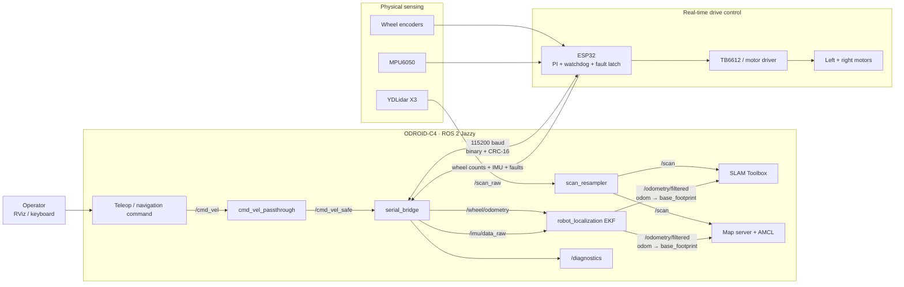
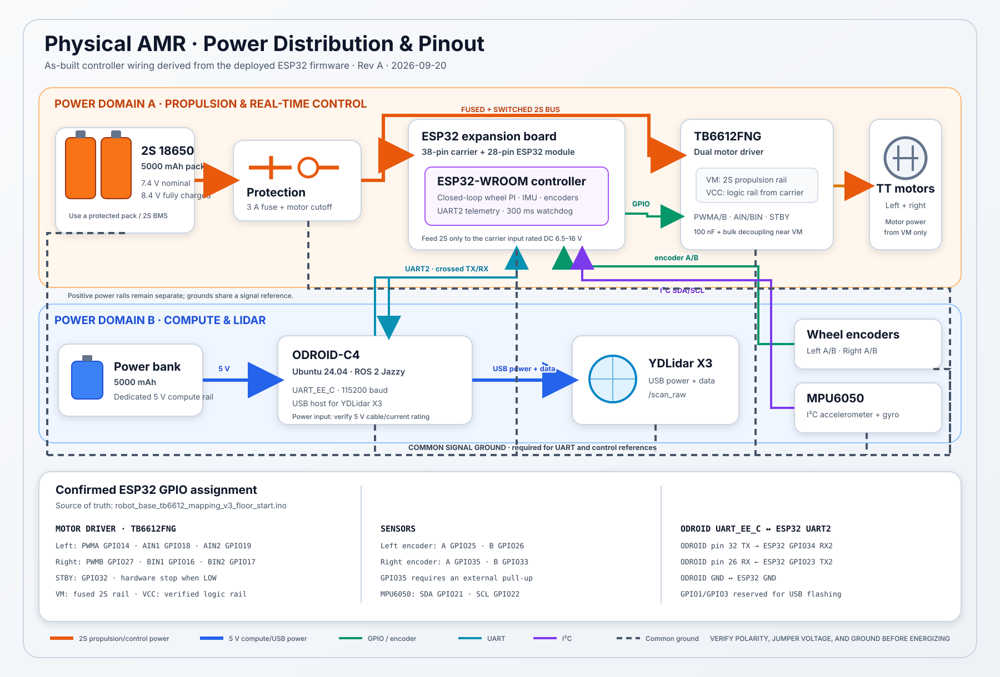
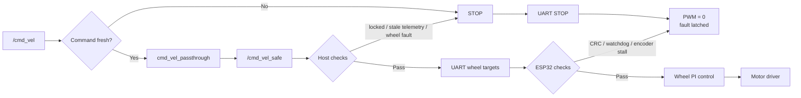
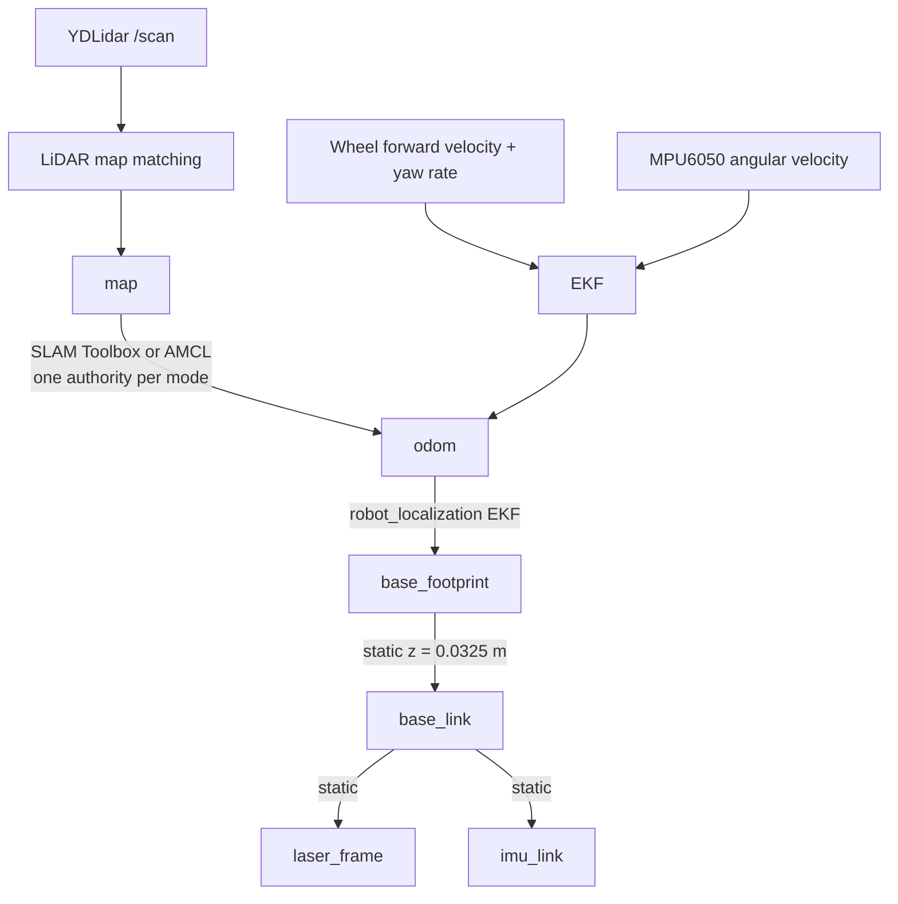
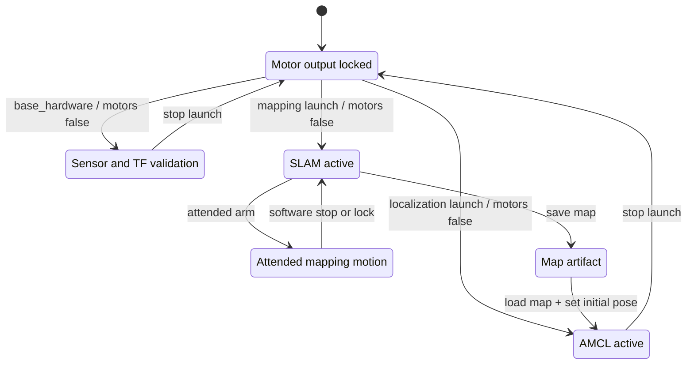

# Physical AMR Base Driver

[](https://docs.ros.org/en/jazzy/)
[](https://releases.ubuntu.com/24.04/)
[](https://www.hardkernel.com/shop/odroid-c4/)
[](docs/VALIDATION.md)
[](LICENSE)

ROS 2 Jazzy hardware integration for a differential-drive indoor delivery
robot. The package connects an ODROID-C4, ESP32 motor controller, YDLidar X3,
wheel encoders, and MPU6050 into a safety-oriented physical stack for manual
driving, synchronous SLAM, and AMCL localization.

This repository contains the robot-side base layer. The web operations
platform and the simulation/vision stack are maintained as related projects:

- [Indoor Delivery Robot Platform](https://github.com/nattannsra18/indoor-delivery-robot)
- [AMR Navigation, Vision & Diagnostics](https://github.com/nattannsra18/amr-navigation-vision-diagnostics)

> [!CAUTION]
> Motor output is disabled by default. Keep a physical motor cutoff within
> reach, clear faults only after freeing the robot, and perform the first run
> after every mechanical change with the wheels unable to propel the chassis.

## Engineering snapshot

| Area | Current baseline |
|---|---|
| Compute | ODROID-C4, Ubuntu 24.04, ROS 2 Jazzy |
| Base | Differential drive, TT motors, passive caster |
| Motor control | ESP32 closed-loop wheel PI, 300 ms command watchdog |
| Ranging | YDLidar X3, raw scan plus angle-aware 360-beam resampling |
| State estimation | Wheel odometry + MPU6050 through `robot_localization` EKF |
| Mapping | Synchronous `slam_toolbox`, 0.03 m/pixel validated profile |
| Localization | Saved-map `nav2_map_server` + AMCL |
| Host safety | Default motor lock, command timeout, wheel-feedback motion guard |
| MCU safety | CRC-16 framing, invalid-packet rejection, watchdog, latched stall fault |
| Command path | Direct passthrough; Drive Supervisor is deprecated/experimental |

Measured results, test conditions, and known limitations are recorded in
[Physical Robot Validation](docs/VALIDATION.md). Private room maps and rosbags
are intentionally excluded from Git.

## System architecture



The ODROID owns ROS orchestration and state estimation. The ESP32 owns the
hard real-time wheel loop and stops PWM if commands expire. Mapping and
localization consume the same conditioned scan and EKF odometry but are run as
separate operating modes.

## Power distribution and physical pinout



The robot uses two positive power domains: a 2S 18650 pack for propulsion and
the ESP32 expansion board, and a separate 5 V power bank for the ODROID-C4 and
USB LiDAR. Their positive rails are not tied together. A common signal ground
is still required between the ODROID, ESP32, sensors, and motor driver so UART
and GPIO levels have the same reference.

The SVG is derived from the GPIO constants in the deployed firmware. Verify
battery polarity, the expansion-board voltage jumper, carrier input rating,
and ground continuity against the physical robot before energizing it.

## Command and safety path

Exactly one node is allowed to publish `/cmd_vel_safe`. Direct passthrough is
the supported path; the former caster-compensation supervisor remains only for
attended regression work because it previously degraded SLAM consistency.



Safety is layered rather than delegated to one process:

1. Launch files default to `enable_motors:=false`.
2. The teleop path has a dead-man timeout and publishes at a watchdog-safe rate.
3. The host motion guard compares commands with wheel feedback.
4. The serial bridge rejects arming when telemetry or faults are unsafe.
5. The ESP32 independently enforces packet validation and a 300 ms watchdog.
6. The physical motor cutoff remains the final attended-test control.

A software stop is an engineering safeguard, not a replacement for a
certified emergency-stop circuit.

## State estimation and TF ownership



The MPU6050 has no magnetometer. Wheel odometry and gyro yaw rate provide local
motion estimation; long-term absolute yaw comes from LiDAR SLAM or AMCL. Only
one node may publish each TF edge.

## Measured physical geometry

`base_footprint` is on the floor below the midpoint of the wheel axle.
`base_link` is one loaded wheel radius above it.

| Item | Measured value | Transform from `base_link` |
|---|---:|---:|
| Wheel radius | 0.0325 m | n/a |
| Wheel separation | 0.355 m centre-to-centre | n/a |
| LiDAR | x=0.345 m from front, z=0.395 m from floor | x=-0.042, y=-0.005, z=0.3625, yaw=0 |
| MPU6050 | x=0.030 m from front, z=0.075 m from floor | x=0.273, y=0, z=0.0425, yaw=0 |

The conservative physical navigation footprint is:

```text
[[ 0.303,  0.190],
 [ 0.303, -0.190],
 [-0.087, -0.190],
 [-0.087,  0.190]]
```

Geometry is chassis-specific. Re-measure it under the robot's real floor load
after changing wheels, hubs, sensor mounts, or the caster assembly.

## ROS interfaces

### Published topics

| Topic | Type | Purpose |
|---|---|---|
| `/scan_raw` | `sensor_msgs/LaserScan` | Original YDLidar samples |
| `/scan` | `sensor_msgs/LaserScan` | Angle-aware, fixed 360-beam scan |
| `/wheel/odometry` | `nav_msgs/Odometry` | Encoder-derived base motion |
| `/odometry/filtered` | `nav_msgs/Odometry` | EKF output used by SLAM/localization |
| `/imu/data_raw` | `sensor_msgs/Imu` | Calibrated raw MPU6050 measurement |
| `/joint_states` | `sensor_msgs/JointState` | Wheel joint state |
| `/diagnostics` | `diagnostic_msgs/DiagnosticArray` | Serial, MCU, motion, and sensor health |

### Commands and services

| Interface | Purpose |
|---|---|
| `/cmd_vel` | Input velocity command |
| `/cmd_vel_safe` | Single-owner command delivered to the base bridge |
| `/set_motors_enabled` | Arm or lock motor output without restarting ROS |
| `/clear_motor_fault` | Clear a latched fault after the physical cause is removed |
| `/reset_wheel_odometry` | Reset integrated wheel pose while stopped |

## Operating modes



Never switch from validation to motion only because nodes are running. Check
the physical area, cutoff, scan alignment, diagnostics, and current robot pose.

## Quick start

### Prerequisites

- Ubuntu 24.04 with ROS 2 Jazzy
- `robot_localization`, `slam_toolbox`, Nav2 map server, and AMCL
- A colcon workspace containing this package and `ydlidar_ros2_driver`
- Stable device names from [`99-amr-serial.rules`](99-amr-serial.rules)

The deployed USB topology assigns `/dev/robot-esp32` to port 1.4 and
`/dev/robot-lidar` to port 1.1. The production ESP32 link uses the ODROID
`UART_EE_C` device at `/dev/ttyAML6`, 115200 baud.

### Build and test

```bash
cd ~/amr_ws
source /opt/ros/jazzy/setup.bash
colcon build --symlink-install --packages-select amr_base_driver
source install/setup.bash
colcon test --packages-select amr_base_driver
colcon test-result --verbose
```

### Validate hardware with motors locked

```bash
source /opt/ros/jazzy/setup.bash
source ~/amr_ws/install/setup.bash
ros2 launch amr_base_driver base_hardware.launch.py enable_motors:=false
```

Confirm that `/diagnostics`, `/wheel/odometry`, `/imu/data_raw`, `/scan`, and
the complete TF chain are healthy before any floor test.

For an attended test, arm without restarting the stack only after those checks
pass and the physical cutoff is ready:

```bash
ros2 service call /set_motors_enabled std_srvs/srv/SetBool "{data: true}"
```

Lock motor output immediately after the run:

```bash
ros2 service call /set_motors_enabled std_srvs/srv/SetBool "{data: false}"
```

Arming sends `STOP` first and requires a fresh command before motion. It is
rejected when serial telemetry is stale or an MCU/host motion fault is active.

## Mapping workflow

The X3 publishes original points on `/scan_raw`. `scan_resampler` maps them by
angle into a stable 360-beam `/scan`; the YDLidar SDK `fixed_resolution` option
must remain disabled because it truncates points while the motor speed settles.

Start SLAM with motor output locked:

```bash
ros2 launch amr_base_driver mapping.launch.py enable_motors:=false
```

For attended mapping only, verify the fuse, physical cutoff, diagnostics, and
clear floor before enabling motion. Drive smooth forward segments and rolling
arcs; avoid high-rate pivots and obstacle contact because both distort scans.

Save the completed map from another terminal:

```bash
mkdir -p ~/maps
ros2 run nav2_map_server map_saver_cli -f ~/maps/indoor_map
```

## Localization workflow

Start the same physical sensing and estimation stack with a saved map:

```bash
ros2 launch amr_base_driver localization.launch.py \
  map_yaml:=/absolute/path/to/indoor_map.yaml \
  enable_motors:=false
```

In RViz, set the initial pose in the `map` frame and verify that `/scan`
overlaps the occupied map cells. Do not expect `/amcl_pose` or `map -> odom`
before the initial pose is established.

If another stack already owns `base_link -> laser_frame`, launch with
`publish_sensor_tf:=false` until the duplicate authority is removed.

## Attended keyboard station

`robot_station.sh station` opens the mapping stack, a watchdog-friendly WASD
controller, and the live sensor dashboard. The controller publishes at 20 Hz
while a motion key remains fresh and sends zero after 0.35 seconds without
input. Space or X stops immediately; Q exits. Press R while stopped to reset
wheel odometry before a tape-measure run.

```bash
./robot_station.sh station
```

From another terminal, send a software stop with:

```bash
./robot_station.sh stop
```

## Fault recovery

After physically clearing the robot and confirming that it is stopped:

```bash
ros2 service call /clear_motor_fault std_srvs/srv/Trigger '{}'
```

Do not move again until `/diagnostics` reports `mcu_fault=0`, an empty
`host_motion_fault`, fresh serial telemetry, and zero wheel motion.

## Firmware and transport

The matching ESP32 firmware and safe flash procedure live in
[`firmware/esp32`](firmware/esp32/README.md). The link uses a fixed 44-byte
binary telemetry frame with CRC-16. The deployed controller uses a 40 MHz
flash clock because the physical board produced repeatable bootloader checksum
failures at 80 MHz.

UART wiring on the ODROID-C4 40-pin header:

| ODROID-C4 | ESP32 |
|---|---|
| Pin 32 TX | GPIO34 RX2 |
| Pin 26 RX | GPIO23 TX2 |
| Ground | Ground |

ESP32 power is supplied separately. USB is connected only when flashing.

## Repository layout

```text
amr-base-driver/
├── amr_base_driver/       # ROS nodes, protocol, safety, and conditioning
├── config/                # Base, EKF, LiDAR, SLAM, and AMCL parameters
├── launch/                # Hardware, mapping, and localization bringup
├── firmware/esp32/        # Deployed controller source and flash guide
├── test/                  # Protocol, safety, estimation, and scan tests
├── docs/VALIDATION.md     # Measured physical validation evidence
├── 99-amr-serial.rules    # Stable USB device naming
└── robot_station.sh       # Attended mapping/calibration workstation
```

## Validation status and limitations

The committed physical baseline has passed build and 34 package tests. It has
also demonstrated synchronous SLAM and AMCL localization on the real robot.
See [docs/VALIDATION.md](docs/VALIDATION.md) for the measured LiDAR scale,
localization comparison, map resolution, and exact test boundaries.

Important limitations:

- The Drive Supervisor is deprecated/experimental and disabled by default.
- The MPU6050 cannot provide absolute heading without LiDAR localization.
- Encoder telemetry cannot detect a wheel hub slipping on its motor shaft.
- Floor friction and passive-caster orientation still affect low-speed motion.
- Physical changes require renewed geometry, stopping, and localization tests.
- Software safeguards do not replace a physical emergency-stop circuit.

## License

Licensed under the [Apache License 2.0](LICENSE).

## Author

Designed and developed by [nattannsra18](https://github.com/nattannsra18).
